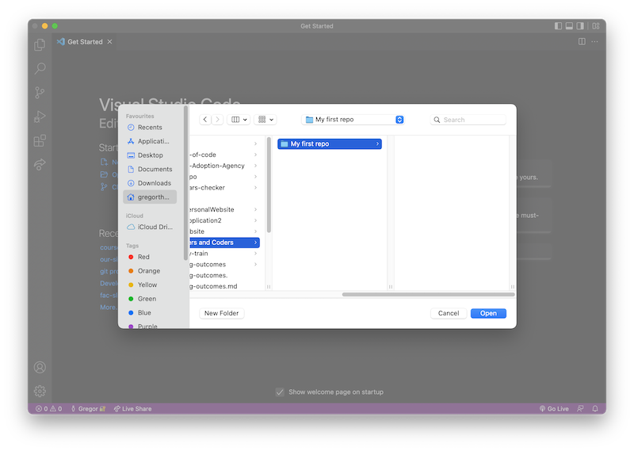
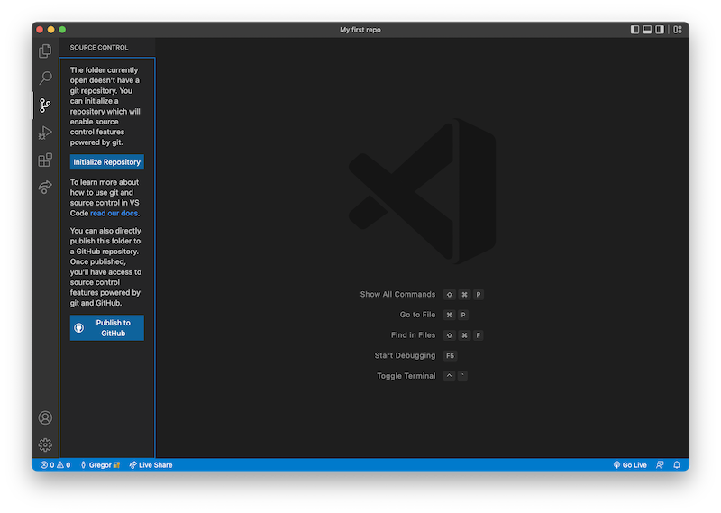
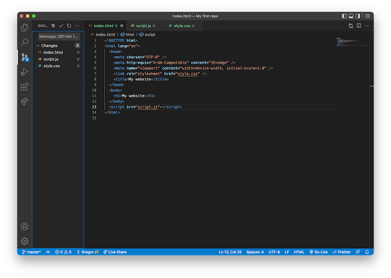
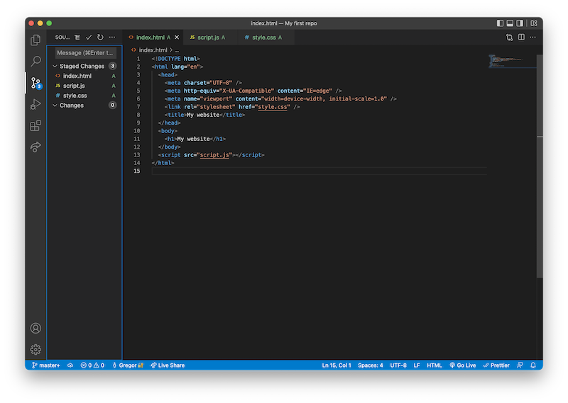
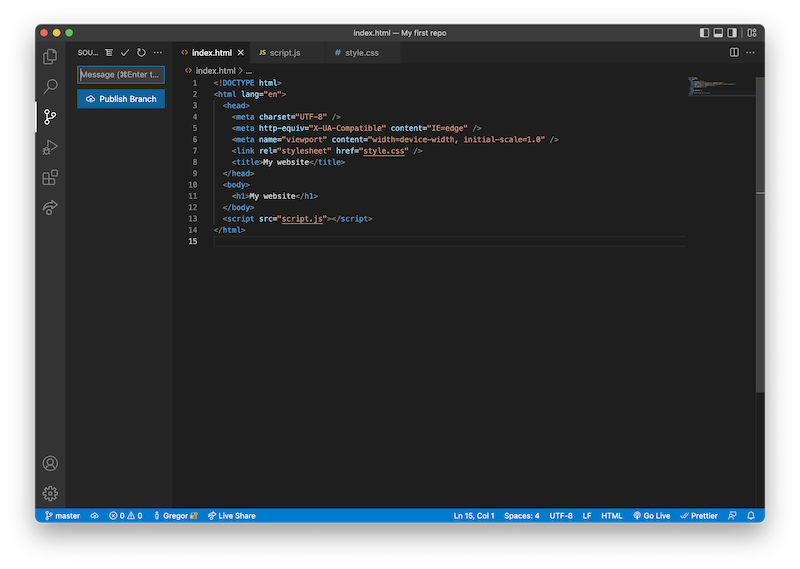
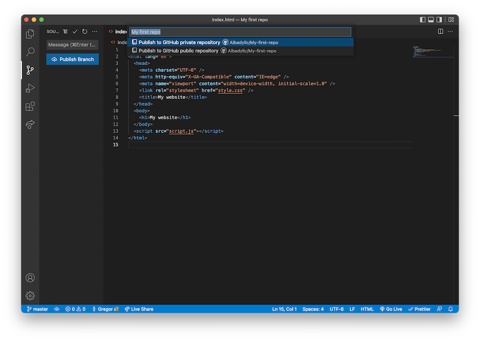
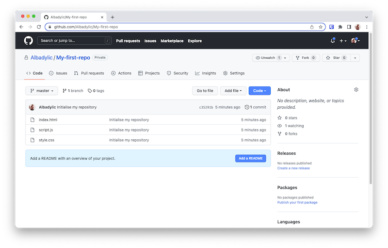

## Git

Git is a a program for controlling versions of a project. It allows you to track changes you make to files over time.

To make an analogy, it's like having a save button on your project. At any time, you can save what you've written and mark that point in time. This means you can review versions of the code or go back to a previous version.

## GitHub

GitHub, although similar in name, is not directly related to Git. GitHub is a platform for storing code online.

Each project is stored in a _repository_ - this is a folder where all the files are contained on GitHub.

GitHub also allows you to host a live version of your website via GitHub Pages. You can share the link with anyone and they can visit websites that you've created!

## Local vs. Remote

We'll describe repositories in terms of local and remote versions.

A _local_ repository is a folder on your computer which you save files to. A _remote_ repository is a folder online which your files can be duplicated to.

## Workflow

When working with Git, you'll need to establish a worflow for synchronising code between a local and remote repository.

For example, if I change files on my computer, I'd like to then update the live version of a website by pushing my files to the remote repository. Or, if I'd like to download a project and create my own version, I might clone a remote repository to my local machine.

Once you've established a connection between your local repository and a remote one, you'll usually make changes on your local machine.

You can then _stage_ the changed files - in other words, tell Git that you'd like these to be tracked in your version history. Staging is used to specify which changes to track, and which not to. For example, you might be ready to add your HTML and CSS files, but have unresolved errors in JavaScript. You can choose to stage some or all of your files.

Then next step is to _commit_ your staged files - marking a save point in your project of the progress so far. Commits should contain a _commit message_ which describes the changes made.

Finally, you'll _push_ your local changes to the remote repository.

## VS Code

A programme you can download which lets you write and edit code on your computer. VS Code is one of the most popular text editors and offers a number of extensions which can be helpful to you as a developer.

### VS Code's source control tab

The _source control tab_ in VS Code allows you to use Git within your text editor. It's offers the ability to stage, commit and push changes between your local machine and a remote repository.

1. Make a new folder on your computer

1. Open this in VS Code

1. Navigate to the source control tab and click 'Initialise repository'

1. Make your changes - here we've created files for HTML, CSS and JavaScript and linked them all together. Back on the source control tab, you can view which files have unstaged changes.

1. Click the add button to stage your files, this will move them to 'Staged Changes'

1. Click the commit button (represented with a tick) to commit those files to your Git history

1. VS Code will prompt you to publish the branch once you've staged all changes. The first time you click this, you'll need to connect to your GitHub account.

1. Finally, publish to a new repository

And that's all! You'll now have published the files to GitHub. If you visit your profile on [GitHub](https://www.github.com) you should now see your repository.

From here, you can continue to stage, commit and push your changes.

You should commit once you have completed a change or feature, not after writing certain amount of code, and don't wait until a project is complete. Getting into the habit of making small commits often will give you a good level of practice with Git. Regularly pushing your changes will ensure your codebase is backed up and version-controlled. Additonally, you'll have GitHub activity on your profile (green squares).
